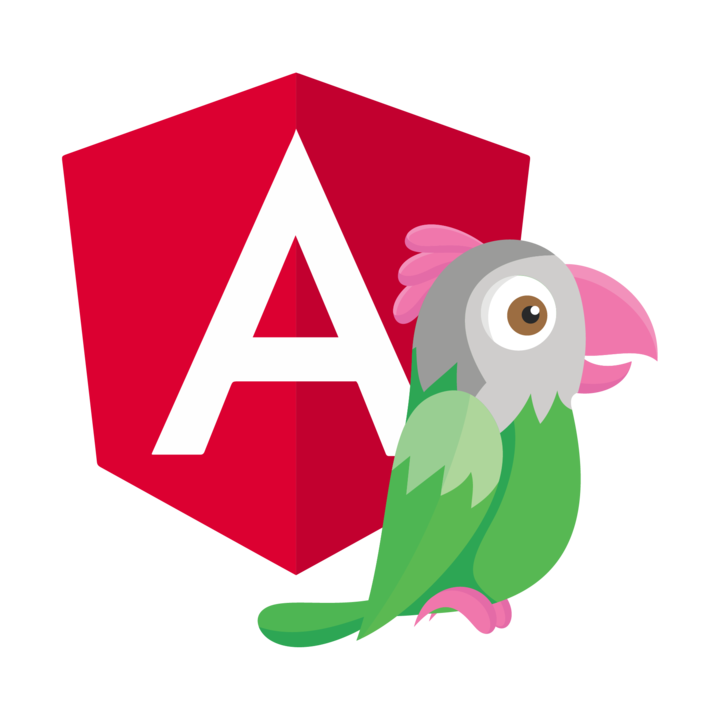

<h1 align="center">
    Notice: Still Under Development
</h1>

<p align="center">
	
</p>


## Features
- Compatible on Angular
- Documented and Self explaining methods
- Small size without any external libraries
- All Javascript API are avaiable
- Maintained by [tawk.to](https://www.tawk.to]) team

<br/>

## Installation
The plugin are available in node and yarn package managers.
```bash
# Node
npm install @tawk.to/tawk-messenger-angular

# Yarn
yarn add @tawk.to/tawk-messenger-angular
```

<br/>

## Quickstart
Import the **tawk-messenger-angular** in your **app.component.ts**. The **propertyId** and **widgetId** will be found on your tawk dashboard **Administration > Chat Widget**.

```js
import { TawkMessengerAngular } from 'tawk-messenger-angular';

@Component({
  selector: 'app-root',
  templateUrl: './app.component.html',
  styleUrls: ['./app.component.sass']
})

export class AppComponent implements OnInit {
  	title = 'tawk-messenger-angular'

	constructor(
		public TawkMessengerAngular: TawkMessengerAngular
	) { }

	ngOnInit(): void {
		this.TawkMessengerAngular.init({
			propertyId: [propertyId],
			widgetId: [widgetId]
		});
	}
}
```

## Documentation

This project includes a `docs` folder with more details on:

1. [How to use](./docs/how-to-use.md)
2. [API Reference](./docs/api-reference.md)
3. [Directives](./docs/directives.md)

<br/>

## Other JS frameworks plugin
- [Vue Js](https://github.com/tawk/tawk-messenger-vue)
- [React Js](https://github.com/tawk/tawk-messenger-react)
- [Angular Js](https://github.com/tawk/tawk-messenger-angular)
- Ember Js

<br/>

## Frequently Asked Questions

**Where you can approach us for suggestion or bug report?**

You can mention us on [Twitter](https://twitter.com/tawktotawk) or in our [Website](https://www.tawk.to/) just message us.
